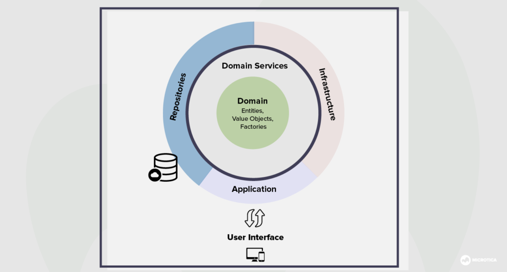

# app-fibonacci

## Use an architecture based on domains (driven domain design) or better known as DDD, in which domain contains all business logic.
 

## I added a MakeFile file in which there are instructions to run the tests and the project:
```sh
    make ensure-deps
    make start
    make test
    make test-cover
```

## To run the project run the command:
```sh
    make start
```
> the project will rise in port 8080

## Endpoint: 
```sh
   curl -X POST -d '{"init": 0,"limit": 20,"index": 6}' -H "Content-Type: application/json" http://localhost:8080/api/v1/fibonacci
```
> It can also be tested using postman or a similar tool.

## format to make the request with postman
```sh
{
    "init": 0,
    "limit": 20,
    "index": 6
}
```
## Possible outcome:
```sh
{
    "data": {
        "The number in the index is": 8
    }
}
```
### The decision is made to use a domain-based architecture so that the application dependencies will be isolated from the business logic and in the future to be able to implement other versions in an easy and scalable way.
### The endpoint was approached as a POST method so that the user had the possibility of placing delimiters where the fibonacci begins and ends, it would also have been possible to use a GET method but passing the index number through a query or a parameter.
### Added some unit tests to verify that the results are as expected and that the function is correct.